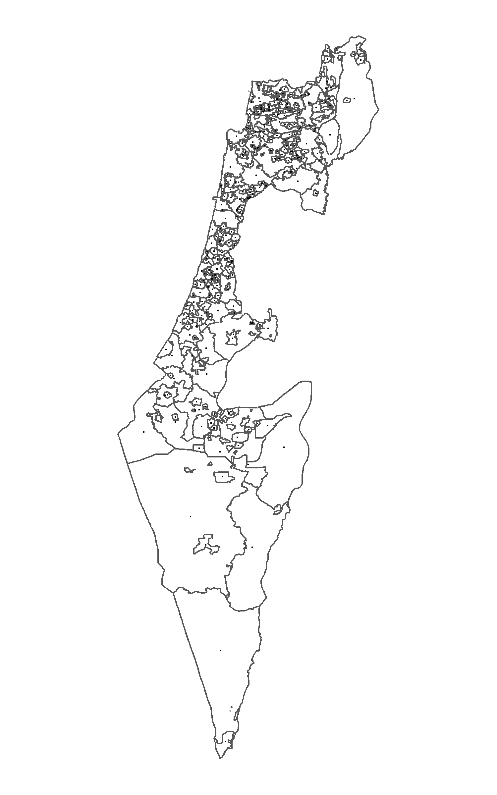

Creating city locations
================
Amit Levinson
6/3/2021

This documents the code for creating the `muni.csv` file containing the
long and lat for each city.

The data is from gov.il using their [jurisdiction
shapefiles](https://www.gov.il/he/departments/guides/info-gis). Since
each municipality might have several polygon values (changes in borders
across years), the polygons were combined for each municipality. From
there I extracted the long & lat values for the centeroid of the
polygon.

The `muni.csv` might contain Hebrew words that aren’t properly read. If
it doesn’t work using Excel or appropriate Unicode, just use the English
names.

**Locations were not validated, that is the users’ responsibility**

``` r
library(sf)
library(dplyr)
library(tidyr)

Sys.setlocale("LC_ALL", "Hebrew")
```

``` r
# List files, specifically the muni_il
cities <- list.files("isr-borders", pattern = ".shp$", recursive = TRUE)[230]

# read it
cities <- read_sf(paste0("isr-borders/",cities))

# Select relevant columns
cities_concise <- cities %>% 
  select(Muni_Heb, Muni_Eng, Machoz, geometry)

# Process data
cities_grouped <- cities_concise %>% 
  group_by(Muni_Heb, Muni_Eng, Machoz) %>% 
  # Combine the different geometries to one by Muni
  summarise(geometry = st_union(geometry)) %>% 
  # It's projected, change to geographic
  st_transform(geometry, crs = 4326) %>% 
  mutate(longlat = st_centroid(geometry)) %>% 
  # Create a long-lat file
  unnest_wider(longlat, names_sep = "_") %>% 
  setNames(c("Muni_Heb", "Muni_Eng", "Machoz", "geometry"  ,"long", "lat"))

# Save as csv
# write.csv(select(cities_grouped, -geometry), "muni.csv")
```

``` r
cities_map <- cities_grouped %>% 
  st_as_sf(crs = 4326)

ggplot(cities_map)+
  geom_sf(fill = "white")+
  geom_point(aes(x = long, y = lat), size = 0.1)+
  coord_sf()+
  theme_void()

# Save and loaded as image below:
# ggsave("map.png", height = 8, width = 5)
```


